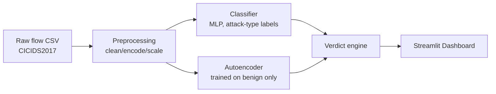
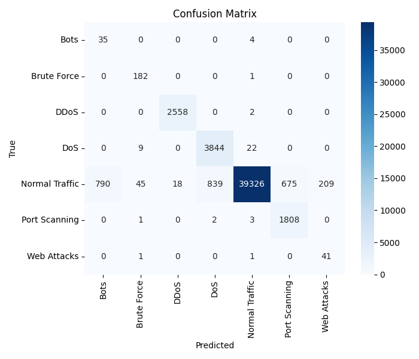
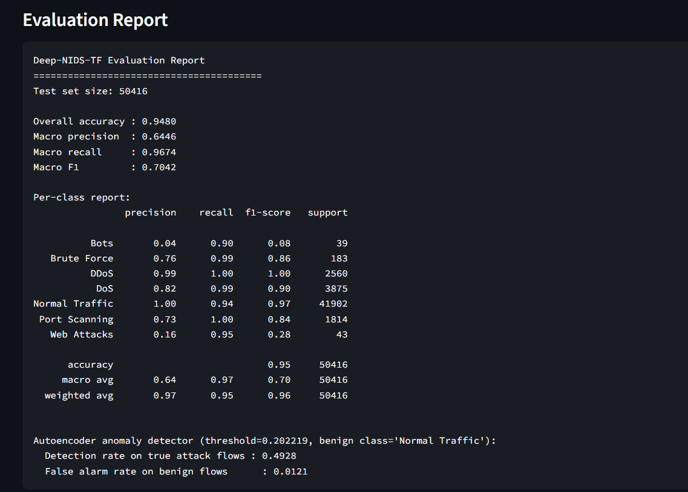
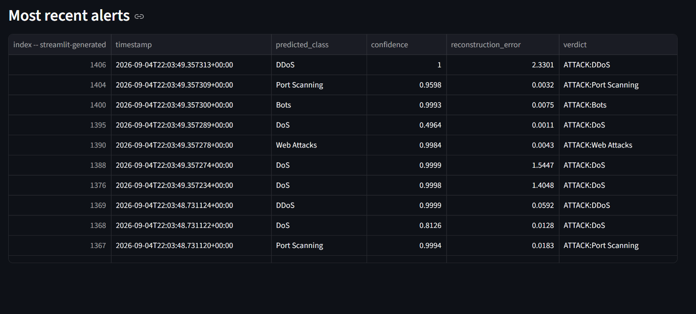

# IntruSense 🛰️

A hybrid deep-learning Network Intrusion Detection System built with TensorFlow —
combining a **supervised classifier** (labels known attack types) with a
**benign-only autoencoder** (flags novel/unknown attacks via anomaly detection),
visualized through a live Streamlit dashboard.

🔗 **[Live demo](https://intrusense-nids.streamlit.app/)**

## Why this approach

Signature-based IDS tools (Snort, Suricata) only catch attacks with known
patterns already written into rules. IntruSense adds a second detection
layer: an autoencoder trained only on normal traffic flags anything that
*reconstructs poorly* — i.e. statistically unusual — as a potential unknown
threat, even without a matching label in training data. In production, an
ML-based NIDS like this is typically deployed as a complement to signature
based tools, not a replacement — one more signal for catching what static
rules miss.

## Architecture



## Results (CICIDS2017 stratified sample, 252k rows)

| Metric | Value |
|---|---|
| Overall accuracy | 94.80% |
| Macro precision | 0.6446 |
| Macro recall | 0.9674 |
| Macro F1 | 0.7042 |

| Autoencoder (anomaly detector) | Rate |
|---|---|
| Detection rate on true attack flows | 49.28% |
| False alarm rate on benign flows | 1.21% |

### Per-class performance

| Class | Precision | Recall | F1 | Support |
|---|---|---|---|---|
| Normal Traffic | 1.00 | 0.94 | 0.97 | 41,902 |
| DDoS | 0.99 | 1.00 | 1.00 | 2,560 |
| DoS | 0.82 | 0.99 | 0.90 | 3,875 |
| Port Scanning | 0.73 | 1.00 | 0.84 | 1,814 |
| Brute Force | 0.76 | 0.99 | 0.86 | 183 |
| Web Attacks | 0.16 | 0.95 | 0.28 | 43 |
| Bots | 0.04 | 0.90 | 0.08 | 39 |



### A known limitation, not an oversight

`Bots` and `Web Attacks` show high recall (the model catches most real
instances) but very low precision (it also flags a lot of unrelated traffic
as these classes). This isn't a tuning failure — it's a direct consequence
of data volume. These two classes make up **under 0.2% combined** of the
training set (~150 and ~136 samples respectively, out of 176k rows). At
that sample size, a 52-feature classifier doesn't have enough signal to
learn a reliable decision boundary, regardless of loss weighting.

I addressed the resulting class imbalance with capped inverse-frequency
class weighting (see `class_weights_from_labels` in `src/train.py`), which
meaningfully improved the moderately-rare classes — `Brute Force` precision
went from 0.32 → 0.76, `DoS` from 0.77 → 0.82 — but weighting alone can't
manufacture signal that isn't in the data for the two rarest classes.

**Given more data or time, next steps would be:**
- Collect or synthesize more `Bots`/`Web Attacks` examples (e.g. SMOTE),
  though synthetic oversampling on flow-level features risks generating
  unrealistic traffic patterns rather than adding real signal.
- Route ultra-rare classes through the autoencoder instead of the
  classifier — since the autoencoder is trained to flag any traffic that
  doesn't reconstruct like normal traffic, it's arguably better suited to
  "too little data to classify confidently" cases than forcing a supervised
  label on them.

## Dashboard




**Note:** the "Live Detection Log" is a simulated real-time feed — it
replays rows from the held-out test set through the trained models in
batches, rather than reading from an actual network tap. See the
docstring in `src/detect.py` for exactly where a real packet-capture /
flow-aggregation pipeline (e.g. scapy + CICFlowMeter) would plug in.

## Tech stack

TensorFlow/Keras · scikit-learn · Pandas · Streamlit

## Project structure

```
IntruSense/
├── data/                    # raw + processed data (gitignored, see data/README.md)
├── models/                  # trained model checkpoints + plots (gitignored)
├── logs/                    # detection logs (gitignored)
├── docs/                    # README screenshots
├── scripts/
│   ├── preprocess_traffic.py
│   └── subsample_dataset.py
├── src/
│   ├── model.py             # classifier + autoencoder architectures
│   ├── train.py
│   ├── evaluate.py
│   └── detect.py            # simulated real-time inference
├── dashboard.py             # Streamlit app
└── requirements.txt
```

## Quickstart

```bash
pip install -r requirements.txt

# Option A: real dataset (see data/README.md for download instructions)
python scripts/subsample_dataset.py
python scripts/preprocess_traffic.py --csv data/cicids_sample.csv --label-col "Attack Type"

# Option B: synthetic demo data, no download needed
python scripts/preprocess_traffic.py --synthetic

# Then, either way:
python src/train.py --epochs 30 --batch-size 256
python src/evaluate.py
python src/detect.py
streamlit run dashboard.py
```

## What I'd improve with more time

- Real-time flow aggregation from live packet capture (currently simulated
  by replaying test data — see "Dashboard" note above)
- ONNX export for lower-latency inference on CPU-only deployment targets
- Concept drift monitoring: alert when live traffic's feature distribution
  or the autoencoder's false-alarm rate drifts from training-time baselines
- Address the `Bots`/`Web Attacks` data scarcity via the autoencoder-routing
  approach described above
